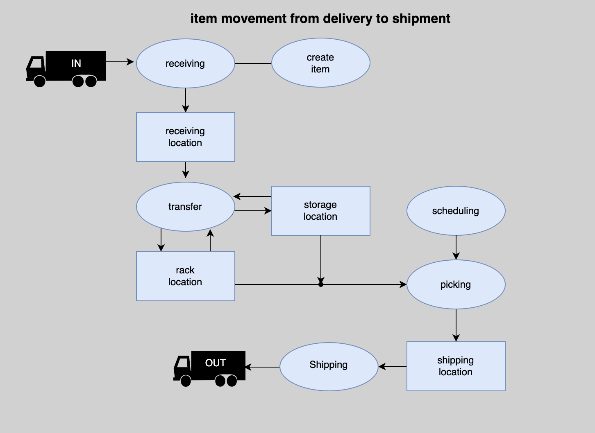

# OpenHouse Inventory Control System

---

#### Video Demo:  <https://www.youtube.com/watch?v=uV_NJHwD2SA>

#### Description:

---

I have been working in manufacturing and warehouses for the last decade. I have used half a dozen inventory control systems, and all of them have two things in common. they are all black screen menus that are navigated via number inputs, and are actually 2 or 3 prograams which interact to work. I wanted to maake an all-in-one program which is visually appealing.

## how it works

---

### Admin functions

#### change password
changes the admin pasword hash in the users table
#### manage users
##### add user
adds username and hash to users table
##### remove user
removes username and hash from users table

#### manage locations
##### add rack
takes rack length and height and desired rack number and propogates the location satble with locations for every position on the rack using the (rack number, column number, row letter) format
##### add location
adds individual location which the admin can name
##### remove location
removes individual locations. i was considering adding a remove rack function but that seemed like too much power to give a potential adversary
#### transaction search
admin can search transaction logs using username, item, and/or location (any or all)
#### change company information
admin can change company name, address, phone, website, customerservice amil, and motto which are used to generate invoices
I wanted to put an upload logo function on this page but I ran out of time

### user functions

#### receiving
adds item quatities to inventory table
(receiving can only be done to receiving locations)

##### add item
adds item to items table, but not to inventory table

#### transfer
removes item/qty from one location and adds it to another in the inventory table
#### scheduling
creates orders in orders table.
adds items to orderitems table
ensures that the qty requested does not exceed quantity in inventory minus the amount already scheduled
#### picking
selects the first instance of the item required on the inventory table and directs the user to it upon picking the item the item is transfered to the desired shipping loctaion
#### shipping
verifies thaty the items picked are in the shippping location and removes them from inventory
#### transaction log
users are only able to see their own transaction history
#### item search + location contents
searches the batabase for item number, item name, or location and displays the locations and qty's for the item or the items and qty for the location

## files

---

| File Name   |   | Description         |
|-------------|---|---------------------|
| openhouse.db | | the database which contains all data. divided into 8 tables |
||| - **users** id, username, hash|
||| - **locations** id, location|
||| - **items** id, itenmuber, name, description, cost|
||| - **inventory** location, item, qty|
||| - **history** id, datetime, user, transaction type, item, loc_to, loc_from, qty, ordernumber|
||| - **orders** id, name, address, ordernum,status, shipdate, shipping_location|
||| - **orderitems** id, order_id, item_id, qty, status, workingqty|
||| - **info** name, address, phone, website, email, motto|
| README.md | | This document |
| requirements.txt | | all required libraries |
| helpers.py | | contains helper functions for login and datetime |
| app.py | | the brains of the project |
| styles.css | | cascading style sheet |
| rage.jfif | | error page image |
| openhouse.bmp | | image for top of all pages |
| logo.bmp | | sample logo used for invoice |
| flowchart.png | | image used to explain work flow in about page |
| racknumbering.bmp | | image to explain rack numbering scheme in about page |
| irregularracknumbering.bmp | | image used to explain irregular racks in about page |
| warehouselayout.png | | image used to explain warehouse layout in about page |
| adminmenu.html | | main menu for the admin |
| usermanagement.html | | menu to add and delete users |
| addlocation.html | | add locations |
| mainmenu.html | | main menu for no admin users |
| companyinfo.html | | page used to edit company information |
| shippingmenu.html | | menu to select order to ship |
| login.html | | login page |
| shipping.html | | menu to help verify that all items are picked and accounted for before shipping |
| index.html | | not used |
| editorder.html | | allows users to add and remove items from an order |
| receiving.html | | creates items in the database |
| transactionsearch.html | | admin can serach history based on item number, user, or location |
| locationmanagement.html | | menu for admin to add rack, add locatio, or remove location |
| layout.html | | basic layout for all pages except invoice |
| removeuser.html | | admin can remove user |
| createitem.html | | redirect to when user tries to receive non existant item, allows them to create new item |
| invoice.html | | invoice based off of order and order items  |
| schedulingmenu.html | | menu of open orders with option to add order |
| picking.html | | displays location of items to be picked and moves the item to the shipping location  |
| transfer.html | | moves items from location to location |
| removelocation.html | | admin can delete locations from the location table |
| changepassword.html | | admin can change admion password |
| addrack.html | | Admin can add rack, auto generates locations in a grid |
| error.html | | oops |
| transactionlog.html | | shows transaction table fro both user and admin |
| table.html | | displays table for both location contents and item locations |
| pickingmenu.html | | menu displays pickable orders |
| neworder.html | | creta enew order |
| about.html | | admin explans everything |
| lookup.html | | serch for item locations or location contents |
| adduser.html | | admin add user and password |

## design choices and technologies used

---

* dark background; save baattey power
* sql; database faster and more robust than csv files
* flask; didn't want to learn django
* datetime; gotta love datetime

## potential Upgrades

---

* an inventory count system
* a way to report missing items
* I'm considering converting it into an internet based subscription service.
* a way to delete orders
* initially i wanted to make a system for both warehouse and manufactuering, but I was limited by time.
* upload logo
* root directoy link in logo on upper left of screen instead of menu link (ran out of time)
* a way to warn the admin if items are running low or if last item has been shipped/scheduled.

